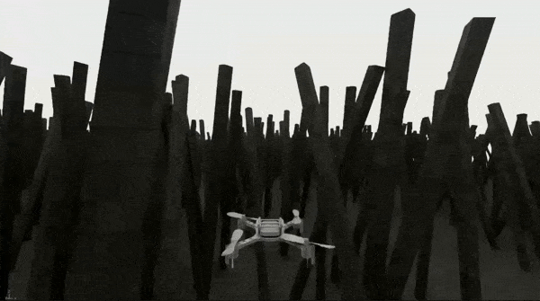

# Isaac Lab Reinforcement Learning Projects

|              |              |
| :----------: | :----------: |
|  |  |

## Description

This repository contains reinforcement learning personal projects using Isaac Lab, extending the environments already present in Isaac Lab with some "experimental" (read: fun) tasks.
More and different projects/environments should be added in the future.


## Available environments

| gym env name   |  description   |  trained policy  |
| :---------- | :---------- | :---------- |
| - `Isaac-Experimental-Legged-StandUp-Pose-Flat-Anymal-C-v0`<br>- `Isaac-Experimental-Legged-StandUp-Pose-Rough-Anymal-C-v0`| Four-legged robot walking on two legs and tracking a pose command on flat or rough terrain | [policies](./trained_policies/experimental_legged_standup_pose_rough_policy_900_010225) (rough terrain)
| - `Isaac-Experimental-Legged-StandUp-Velocity-Flat-Anymal-C-v0`<br>- `Isaac-Experimental-Legged-StandUp-Velocity-Rough-Anymal-C-v0` | Four-legged robot walking on two legs and tracking a velocity command on flat or rough terrain | [policies](./trained_policies/experimental_legged_standup_velocity_rough_policy_48000_191224) (rough terrain)
| - `Isaac-Experimental-Quadcopter-Forest-Pose-Direct-v0` | Quadcopter flying through a forest environment towards a goal point | [policies](./trained_policies/experimental_quadcopter_forest_pose_policy_12000_291224)

The environments are immediately ready for training: the provided code sets up the relevant scene, network, sensors, rewards, etc. configurations.
Trained policies for some environments are provided in the folder [trained_policies](./trained_policies) (trained using the scripts in [scripts](./scripts/)).

In each environment, the agent receives noisy observations from its state and sensors.


### Four-legged robot walking on two legs and tracking a pose command on flat or rough terrain

|  |  |
| :---------- | :---------- |
| <video src="https://github.com/user-attachments/assets/c93d754d-7571-476c-81d9-11b22351b71a" />| **-> Train an Anymal-C robot to stand up on its hind legs and track a pose command (xy and theta).**<br><br>For rough terrains, the robot is equipped with a height scanner sensor (0.8m x 1.1m with 0.1m resolution: 108 samples) to obtain terrain observations.<br><br>The pre-trained policy from the velocity command environment is used as a low-level policy.<br><br>A policy trained on rough terrain with 2048 envs for 900 iterations (~2 hours) is provided [here](./trained_policies/experimental_legged_standup_pose_rough_policy_900_010225/) (trained on top of the pre-trained policy of the velocity command environment). |


### Four-legged robot walking on two legs and tracking a velocity command on flat or rough terrain
|  |  |
| :---------- | :---------- |
| <video src="https://github.com/user-attachments/assets/d4a98e04-6289-4030-aaa2-3d9227f6edfa" /> | **-> Train an Anymal-C robot to stand up on its hind legs and track a velocity command (linear and angular velocity).**<br><br>For rough terrains, the same height scanner sensor of the pose command environment is used.<br><br>A policy trained on rough terrain with 2048 envs for 48000 iterations (~44 hours) is provided [here](./trained_policies/experimental_legged_standup_velocity_rough_policy_48000_191224/). |


### Quadcopter flying through a forest environment towards a goal point
|  |  |
| :---------- | :---------- |
| <video src="https://github.com/user-attachments/assets/267dee3b-7cce-4f59-9008-8b58c65c802a" /> | **-> Train an agile quadcopter to fly towards a goal point located outside a forest, avoiding the trees.**<br><br>The drone is equipped with a simple 2D lidar sensor: one channel with 140° FOV and 5° resolution (29 rays).<br><br>A policy trained with 2048 envs for 12000 iterations (~3 hours) is provided [here](./trained_policies/experimental_quadcopter_forest_pose_policy_12000_291224/). |


## How to


### Installation

First, you need to clone/install [Isaac Lab](https://github.com/isaac-sim/IsaacLab).
Then, create a directory called `experimental` inside `IsaacLab/source/extensions/omni.isaac.lab_tasks/omni/isaac/lab_tasks`.
Now move inside the new `experimental` directory all the ***experimental_\**** folders of this repository, and create an empty `__init__.py` file.
The final structure should be:
```
IsaacLab/   <-- original Isaac Lab repository
  |- source/
      |- extensions/
           |- omni.isaac.lab_tasks/
                |- omni/
                     |- isaac/
                          |- lab_tasks/
                               |- experimental/   <-- create a parent directory
                                    |- __init__.py   <-- create an empty init file
                                    |- experimental_legged/       <-- moved
                                    |- experimental_quadcopter/   <-- moved
                                    |- experimental_utils/        <-- moved
```


### Train and play an agent

After you have correctly moved the relevant folders to the Isaac Lab repository, the new environments will be registered automatically in the gym environment registry.
You can now run an environment in the same way you would run an original Isaac Lab environment. 

You can train and play an agent using the scripts provided in the [scripts](./scripts) folder (see the [scripts/README.md](./scripts/README.md)).


## System
The environments were created (and the agents were trained) using:
- `Isaac Lab 4.2.0` commit [5d86a8b](https://github.com/isaac-sim/IsaacLab/commit/5d86a8bf6bd1d6b8b13ab157148e4596e109261b), using the official Docker container.
- NVIDIA GeForce RTX 4060 (8 GB), with Driver Version 535.183.01


## Acknowledgments

Framework from [Isaac Lab](https://github.com/isaac-sim/IsaacLab); PPO algorithm from [rsl_rl](https://github.com/leggedrobotics/rsl_rl).
